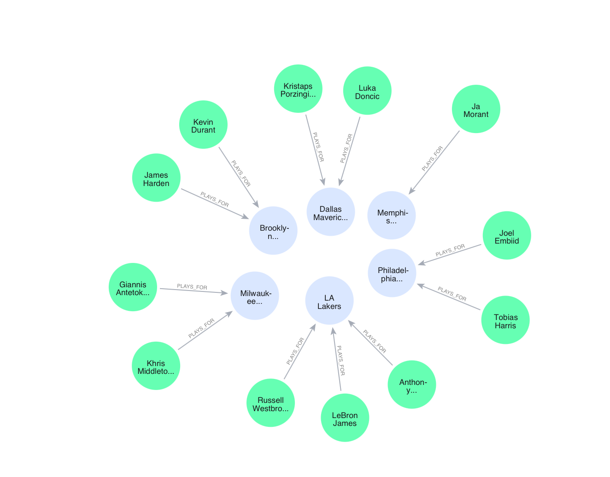
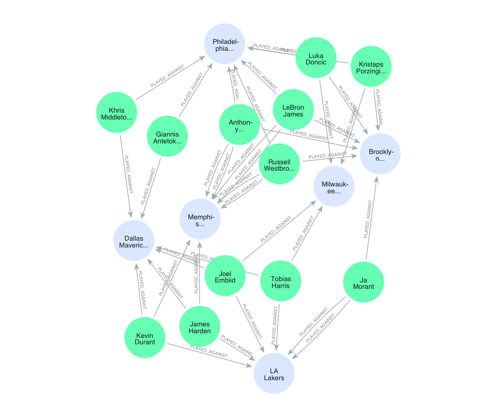
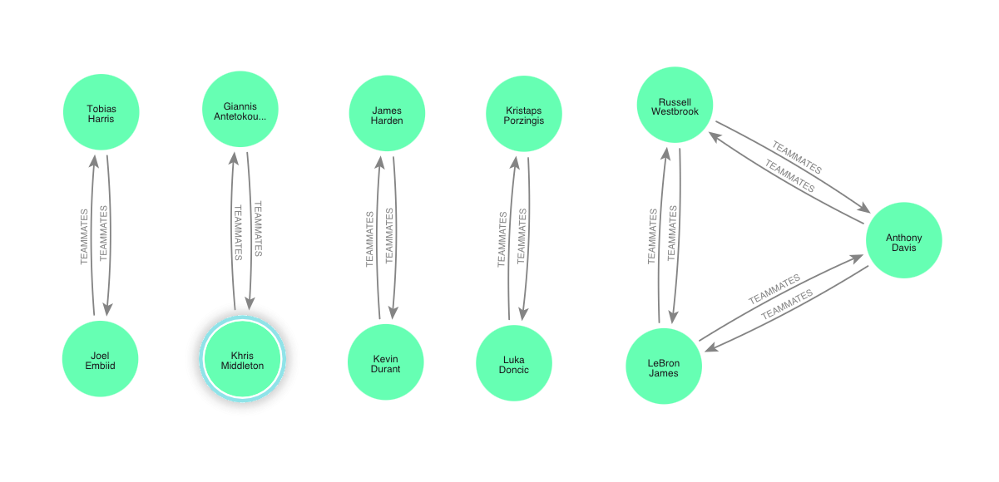

# Basketball Database Project
*This project is maid by `Amine Mrabet` and `Vinay Kumar`*

This project connects to a MongoDB database and inserts basketball player, coach, team, and relationship data. The database is structured into collections for players, coaches, teams, and relationships, with various data on players' details, coaches' assignments, team rosters, and the relationships between players, coaches, and teams.

## Requirements

- Python 3.x
- `pymongo` package
- `neo4j` package
- `redis` package
- `python-dotenv` package
- MongoDB compass
- Neo4j Aura account


## Code Explanation (mongoDB)

This code explanation is related to the notebook under  `notebooks/ > mongo.ipynb`
1. **Environment Setup**: 
    - The `dotenv` package is used to load MongoDB credentials from a `.env` file.

2. **MongoDB Connection**:
    - The MongoDB URI is constructed using the loaded credentials, and a connection to the MongoDB cluster is established using `MongoClient`.

3. **Database & Collections**:
    - The database `basketball_database` is created, containing four collections: `players`, `coaches`, `teams`, and `relationships`.

        ```python
        db = client["basketball_database"]

        # Collections
        players = db["players"]
        coaches = db["coaches"]
        teams = db["teams"]
        relationships = db["relationships"]
        ```

4. **Data Insertion**:
    - The `players_data`, `coaches_data`, `teams_data`, and `relationships_data` lists contain predefined data for players, coaches, teams, and their relationships.
    - The data is inserted into the respective MongoDB collections using the `insert_many()` method.

5. **Data Structure**:
    - **Players**: Information such as name, age, height, weight, and jersey number for each player.
    - **Coaches**: Names of the coaches.
    - **Teams**: Names of basketball teams.
    - **Relationships**: Various relationships between players (teammates, coaches, plays for team, played against).


## Code Explanation (Neo4j)
This code explanation is related to the notebook under  `notebooks/ > neo4j.ipynb`
1. **MongoDB Connection:**

    - MongoDB Atlas credentials are retrieved from environment variables.
    - A connection is established to the MongoDB cluster using the pymongo library.
    - The script retrieves three collections: players, teams, and relationships from the basketball_database.

2. **Neo4j Connection:**

    - Neo4j Aura credentials are also retrieved from environment variables.
    - A connection is established to the Neo4j database using the neo4j library.
        ```python
        uri = URI
        username = "neo4j"
        password = NEO4J_PASSWORD
        AUTH = (username, password)

        driver = GraphDatabase.driver(uri, auth=(username, password))

        # Create a session
        session = driver.session()
        ```

3. **Data Transformation and Insertion:**

    - For each player in the MongoDB players collection, a corresponding Player node is created in Neo4j with attributes like name, age, number, height, and weight.
    - Each team in the MongoDB teams collection is added as a Team node in Neo4j.
    - Relationships between players and teams (e.g., "PLAYS_FOR", "TEAMMATES"), players and coaches (e.g., "COACHES"), and match statistics (e.g., "PLAYED_AGAINST") are created as relationships in the Neo4j database.

## Example Data Structure

MongoDB `players` collection

```json
{
  "name": "LeBron James",
  "age": 36,
  "number": 23,
  "height": 6.9,
  "weight": 250
}
```

MongoDB `teams` collection

```json
{
  "name": "Los Angeles Lakers"
}
```

MongoDB `relationships` collection

```json
[
  {
    "type": "PLAYS_FOR",
    "player": "LeBron James",
    "team": "Los Angeles Lakers",
    "salary": 40000000
  },
  {
    "type": "TEAMMATES",
    "player1": "LeBron James",
    "player2": "Anthony Davis"
  },
  {
    "type": "COACHES",
    "player": "LeBron James",
    "coach": "Frank Vogel"
  },
  {
    "type": "PLAYED_AGAINST",
    "player": "LeBron James",
    "team": "Golden State Warriors",
    "minutes": 40,
    "points": 30,
    "assists": 8,
    "rebounds": 10,
    "turnovers": 3
  }
]
```

## Example Neo4j commends

```neo4j
MATCH (p:PLAYER)-[r:PLAYS_FOR]->(t:TEAM)
RETURN p, t, r;
```
<p align="center">
    
</p>

```neo4j
MATCH (p:PLAYER)-[r:PLAYED_AGAINST]->(t:TEAM) 
RETURN p, r, t;
```

<p align="center">
    
</p>

```neo4j
MATCH (p1:PLAYER)-[:TEAMMATES]-(p2:PLAYER)
RETURN p1, p2;
```

<p align="center">
    
</p>

### For further `Neo4j` queries you can check `query.cypher`


## Code Explanation (Redis)
This code explanation is related to the notebook under  `notebooks/ > redis.ipynb`

1. **Neo4j Connection**
    - The script connects to the Neo4j Aura database using the credentials provided in the .env file.
    - The GraphDatabase.driver method is used to establish the connection with the Neo4j instance.
2. **Redis Connection**
    - A connection to the Redis server is established locally (default: localhost, port 6379).
    - Redis is used to cache the player data fetched from Neo4j to optimize read performance.
        ```py
        r = redis.StrictRedis(host='localhost', port=6379, db=0)
        ```

3. **Fetching and Caching Data**

    1. Fetching Data from Neo4j:
        - The `get_all_players_from_neo4j` function retrieves all players' details (name, age, and number) from the Neo4j database.
        - The Cypher query `MATCH (p:PLAYER) RETURN p.name AS name, p.age AS age, p.number AS number` is used to fetch the relevant data.

    2. Caching Data in Redis:
    
        - The `cache_players_in_redis` function takes the fetched player data and stores it in Redis. Each player is stored as a JSON string, with the key being `player:{player_name}`.

    3. Retrieving Data from Redis:

        - The `get_player_from_cache` function checks if player data is already cached in Redis. If cached, it returns the data; otherwise, it returns None.